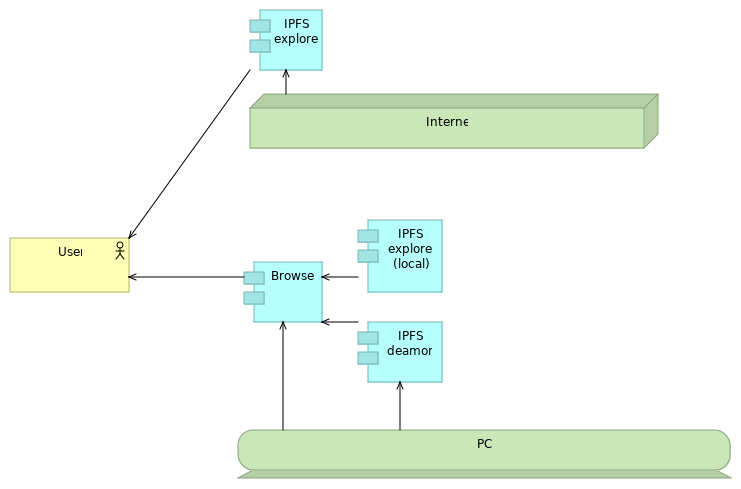

![logo][]

[logo]:   https://web3examples.github.io/logo.png

# IPFS
Examples related to ipfs

| IPFS Concepts   | Instances                   | More info (text) | More info (video) |   Install  |  Examples |
| --------------- |  ---------                  | ---------       | ---------          | ---------  |  -------- | 
| General info    |                                    | [ipfs.io] [primer] [reddit] [consensys-intro] [Kauri] [Train] [Mozilla]|[Youtube] [dimzrio]| [github-ipfs] 
| Architecture    |                                    | 
| IPFS Content Identifiers | [cids]                    |                 |                    |            |[gethash](gethash) 
| Dns link        |                                    | [dnslink] [dnslink.io] [cloudflare-dnslink]     |
| IPFS Node       | [go-ipfs] [js-ipfs] [orion]  | [Install-ipfs] |             | [js-ipfs-github]  |           |
| IPFS API        |    | [infura-ipfs] | [upload-js]
| IPFS Connect to Web2 |                        | [userfriendly]
| IPLD DAG        |                               |                |                    |          |  [Tutorial] |

[js-ipfs]:         https://js.ipfs.io/
[ipfs.io]:         https://ipfs.io
[primer]:          http://dweb-primer.ipfs.io 
[reddit]:          https://www.reddit.com/r/IPFS
[IPFS Alpha Demo]: https://www.youtube.com/watch?v=8CMxDNuuAiQ
[Install IPFS]:    https://docs.ipfs.io/introduction/install/
[Tutorial]:        https://proto.school/#/tutorials
[go-ipfs]:         https://github.com/ipfs/go-ipfs
[js-ipfs-github]:  https://github.com/ipfs/js-ipfs
[orion]:           https://orion.siderus.io
[github-ipfs]:     https://github.com/ipfs
[userfriendly]:    https://hackernoon.com/ten-terrible-attempts-to-make-the-inter-planetary-file-system-human-friendly-e4e95df0c6fa
[cids]:            https://docs.ipfs.io/guides/concepts/cid/
[dnslink]:         https://docs.ipfs.io/guides/concepts/dnslink/
[dnslink.io]:      http://dnslink.io/
[consensys-intro]: https://medium.com/@ConsenSys/an-introduction-to-ipfs-9bba4860abd0 
[How to]:          https://medium.com/pinata/how-to-pin-to-ipfs-effortlessly-ba3437b33885
[Install-ipfs]:    https://kauri.io/article/b01b9b7bebcd4ebf80edf021bdd0e232
[Kauri]:           https://kauri.io/search-results?q=ipfs
[Train]:           https://decentralized.blog/getting-to-know-ipfs.html
[Youtube]:         https://www.youtube.com/results?search_query=ipfs
[Mozilla]:         https://hacks.mozilla.org/?s=ipfs
[dimzrio]:         https://www.youtube.com/playlist?list=PLNblnG6W6-KImttnlK9zRdJ_iqyUMvHz7
[eleks]:           https://labs.eleks.com/2019/03/ipfs-network-data-replication.html
[github-cluster]:  https://github.com/ipfs/ipfs-cluster
[go-cluster]:      https://cluster.ipfs.io/
[cluster-setup]:   https://medium.com/coinmonks/setting-up-your-first-distributed-private-storage-network-on-ipfs-part-1-a6ff15222b90
[infura-ipfs]:     https://infura.io/docs/ipfs/get/pin_add
[cloudflare-dnslink]: https://developers.cloudflare.com/distributed-web/ipfs-gateway/connecting-website/
[upload-js]:           https://www.youtube.com/watch?v=I0UolzV3ico&feature=share

| Building blocks   | Instances | Tutorials |  Github |
| ---------------   |  ---------  |----------- | ------ |
| Encrypted storage | [textile] [linnia]
| Search            | [mahuta] [lens] [ipfs-search] | | [mahuta-github]
| IPFS Cluster      | [go-cluster]   | [eleks] [cluster-setup]   | [github-cluster]
| IPFS Pinning      | [Pinata] [temporal] | [How to] | [temporal-docs]
| IPFS Gateway      | [gateway-check] | [cloudflare-gtw] | | [gtw-setup]

[Pinata]:          https://pinata.cloud
[temporal]:       https://temporal.cloud/
[temporal-docs]:  https://ipfs.io/ipns/docs.api.temporal.cloud/
[textile]:         https://textile.io/
[linnia]:          https://github.com/ConsenSys/linnia-resources
[lens]:            https://temporal.cloud/lens
[ipfs-search]:     https://ipfs-search.com
[mahuta-github]:   https://github.com/ConsenSys/Mahuta
[mahuta]:          https://kauri.io/article/874b1fe11d00406bbbef053405fd4538/ipfs-store-a-search-engine-for-the-distributed-web
[gateway-check]:   https://ipfs.github.io/public-gateway-checker
[cloudflare-gtw]:  https://developers.cloudflare.com/distributed-web/ipfs-gateway/
[gtw-setup]:       https://medium.com/@rossbulat/introduction-to-ipfs-set-up-nodes-on-your-network-with-http-gateways-10e21ea689a4

| IPFS Applications | Instance            |  Github |
| ---------------   |  ---------          | ------- |
| Overview          | [awesome]
| Static websites   | [gatsby] 
| Encrypted storage | [dweb] [hardbin] | [dweb-github] [hardbin-github]
| Pinning           | [twpinbot]          | twpinbot-github]
| IPFS Explorer     | [webui]  [ipld explore] | [webui-github] [ipld-exp-github]
| Editor            | [peerpad]           | [peerpad-github]
| Dataset storage   | [qri]   | [qri-github]
| Video hosting     | [dtube]     | [dtube-github]

[gatsby]:          https://interplanetarygatsby.com/ipfs-deploy/
[awesome]:         https://awesome.ipfs.io
[dweb]:            https://dweb.page/ 
[dweb-github]:     https://github.com/PACTCare/Dweb.page
[hardbin]:         https://hardbin.com
[hardbin-github]:  https://github.com/jes/hardbin
[twpinbot]:        https://twitter.com/ipfspin
[twpinbot-github]: https://github.com/hsanjuan/twitter-pinbot
[webui]:           https://webui.ipfs.io
[webui-github]:    https://github.com/ipfs-shipyard/ipfs-webui
[ipld explore]:    https://explore.ipld.io/
[ipld-exp-github]: https://github.com/ipfs-shipyard/ipld-explorer
[peerpad]:         https://peerpad.net/#/
[peerpad-github]:  https://github.com/ipfs-shipyard/peerpad
[qri]:             https://qri.io/
[qri-github]:      https://github.com/qri-io
[dtube]:           https://d.tube
[dtube-github]:    https://github.com/dtube
