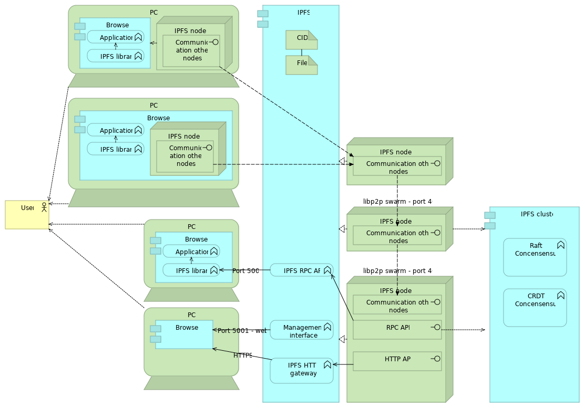

![logo][]
# IPFS
Examples related to ipfs

| IPFS Concepts   | Instances                   | More info (text) | More info (video) |   Install  |  Examples |
| --------------- |  ---------                  | ---------       | ---------          | ---------  |  -------- | 
| General info    |                             | [ipfs.io]       |  
| Architecture    |                             | 
| IPFS Hashing    |                             |                 |                    |            |[gethash](gethash) |
| IPFS Node       | [go-ipfs][] [js-ipfs][] [orion][]   |
| IPFS Explorer   | [webui][]  [ipld explore][]
| IPFS Pinning    | [Pinata](https://pinata.cloud) | [How to](https://medium.com/pinata/how-to-pin-to-ipfs-effortlessly-ba3437b33885) 
| IPLD DAG        |                               |                |                    |          |  [Tutorial] |

[ipfs.io]:         https://ipfs.io
[IPFS Alpha Demo]: https://www.youtube.com/watch?v=8CMxDNuuAiQ
[Install IPFS]:    https://docs.ipfs.io/introduction/install/
[Tutorial]:        https://proto.school/#/tutorials
[go-ipfs]:         https://github.com/ipfs/go-ipfs
[js-ipfs]:         https://github.com/ipfs/js-ipfs
[orion]:           https://orion.siderus.io
[webui]:           https://webui.ipfs.io
[ipld explore]:    https://explore.ipld.io/
[logo]: https://web3examples.github.io/logo.png
